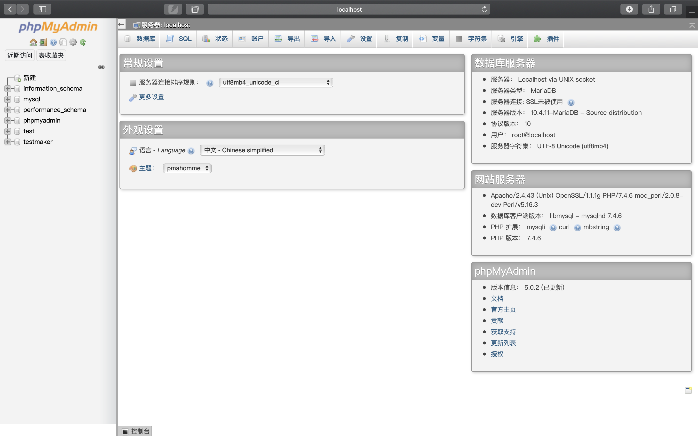
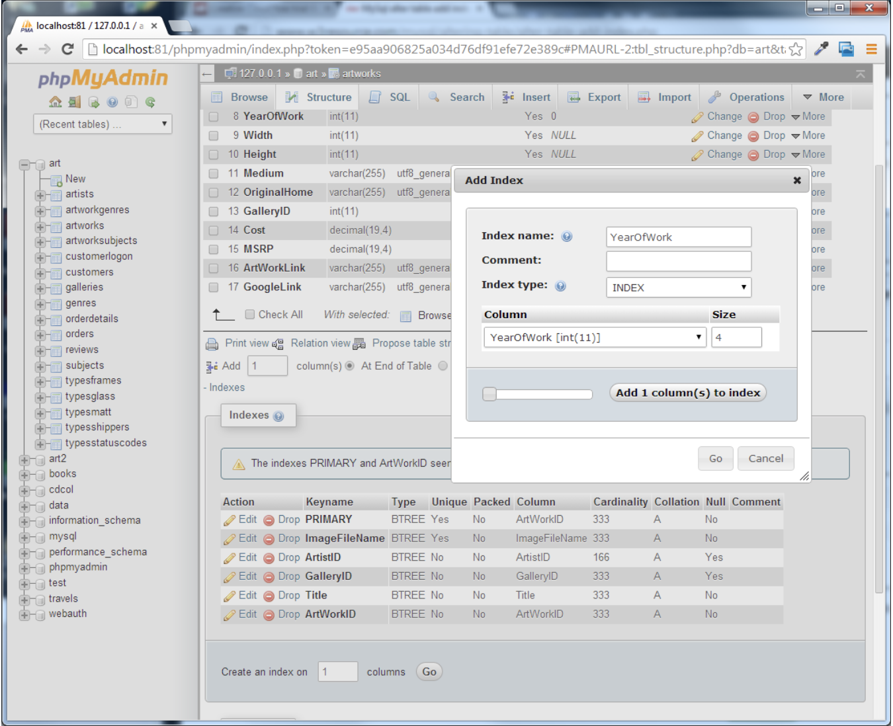
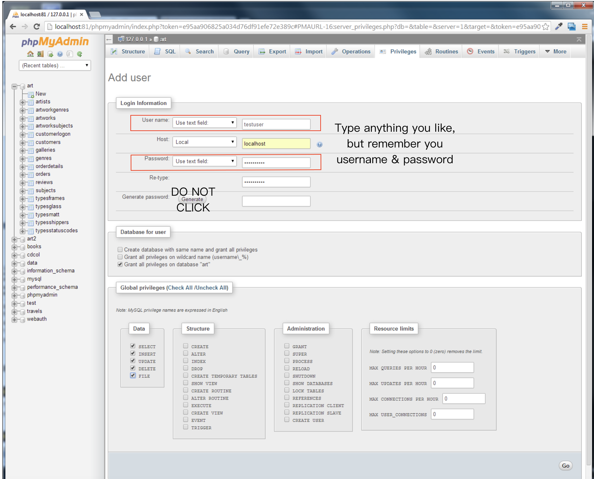

# Lab10

>Goal of Lab10:  
>You will learn
>1. How to install and manage a MySQL database  
>2. How to use SQL queries in you PHP code  
>3. How to integrate user inputs into SQL queries
>4. How to manage files inside of a MySQL database  
>

**From Exercise1 to Exercise6, you don't have to take screenshots or write documents, just do it!**  

**From Exercise7 to Exercise9, you need to take scrrenshot and write document as command.**  

**Exercise 10 is optional, it doesn't matter to your score whether you do it. But it may be helpful to you Project 2~**
 

**DDL: 23:59:59 June 7th, 2020**  

>What you should submit:  
>1. Submit the whole project(including codes/document) to your github.
>2. Submit your github address and document to Elearning.

Please contact with us if you have any questions:)  

  
## Exercise1: phpmyadmin   
**Do not need to take screenshots.**

1. Since you have install `XAMPP`, open XAMPP and start all services `apache, mysql, ProFTPD`. And now you can visit <http://localhost/phpmyadmin/>  
   Hint: the page shows as Figure1.  
     
   _Because MySQL has a blank password by default and phpMyAdmin uses the same credentials as MySQL, phpMyAdmin has a blank password by default as well, which makes setup significantly easier for users. Since developers generally don't (and often shouldn't) put sensitive/important data in a development environment like Cloud9, having no password on phpMyAdmin is rarely an issue._  
2. The left side of **phpMyAdmin** displays the existing databases in `MySQL`. 
A default installation of `MySQL` contains a variety of system tables used by `MySQL` 
(which depending on your installation may or may not be visible here).  

## Exercise2: INSTALLING DATABASE IN PHPMYADMIN   
**Do not need to take screenshots.**

1. Examine `art-small.sql` in a text editor. When done, close the file.  

   These import scripts contain the necessary `DDL` statements to define the database tables as well as the _INSERT_ statements to populate the tables with data.
2. In **phpMyAdmin**, click on the `Databases` tab.  
3. Create a database called _art_.  

   _When it is complete, the `art` database will be visible in left-side of phpAdmin window._  
4. Click on `art` database on left-side of window.  

   _Currently there are no tables in this database. You can manually create a new table
   here, or using the art.sql script to populate the database._  
5. Click on the `Import` tab.  
6. Use the **Choose File** button to select the `art-small.sql` file examined in **step 1**. Then
   click the **Go** button.  
   _If import works successfully, then you should be able to examine the tables in the database._  
   
   _Probably one of the most common problems encountered by students is that a timeout error occurs or that a file exceeds the maximum upload size. Fixing this may require modifying your php.ini configuration file or using the MySQL Monitor instead to import the data. Ask your instructor (or look online) for guidance._  
   
7. Create a database named `travel` and then import `travels-small.sql`. Verify that it creates and populates a variety of tables.  
8. Create a database named `book` and then import `books-small.sql`. Verify that it creates and populates a variety of tables.  

## Exercise3: QUERYING A DATABASE  
**Do not need to take screenshots**  


1. In **phpMyAdmin**, click on the `art` database, then click on the `SQL` tab.
   You should see the message `“Run SQL query/queries on database art:”`  
2. In the blank SQL window, enter the following.  
```select * from Artists```  
_In MySQL, database names correspond to operating system directories while tables correspond to one or more operating system files. Because of this correspondence, table and database names ARE case sensitive on non-Windows operating systems._  
3. Now press the **Go** button.  
_This will run the query. Notice that only the first 30 records are retrieved. This limit is appended to each query for performance reasons (you likely will not want all million records in a given table for instance). If you wish to see all the records retrieved from a query, there is a Show All link at the bottom of the retrieved records._  
4. Return to the SQL window, enter the following new query, and then press **Go**.  
   ```
   select paintingid, title, yearofwork from Paintings   
   where yearofwork < 1600
   ```  
   _This will display just the paintings prior to 1600. Notice that in MySQL, a query can be spread across multiple lines. SQL in general is not case sensitive, which means you do not have to worry about the case of field names. However, remember the comment in the above step 2: in MySQL, table names are case sensitive on non-Windows environments._  
   
5. Modify the query (you can click the `Show query box link`) as follows and test.  
   ```
   select paintingid, title, yearofwork from Paintings
   where yearofwork < 1600 order by yearofwork
   ```  
6. Modify the query as follows and test.  
   ```
   SELECT Artists.ArtistID, Title, YearOfWork, LastName FROM Artists 
   INNER JOIN Paintings ON Artists.ArtistID = Paintings.ArtistID
   ```  
   _This query contains a join since it queries information from two tables. Notice that you must preface ArtistId with the table name since both joined tables contain a field called ArtistId._  
   
7. Modify the query as follows and test.  
   ```
   SELECT Nationality, Count(ArtistID) AS NumArtist  
   FROM Artists  
   GROUP BY Nationality
   ```  
   _This query contains an aggregate function as well as a grouping command._  
   
## Exercise4: MODIFYING RECORDS  
**Do not need to take screenshots**  


1. In **phpMyAdmin**, click on the `art` database, then click on the `SQL` tab.
      You should see the message `“Run SQL query/queries on database art:”`  
2. In the blank SQL window, enter the following.  
   ```
   insert into Artists (firstname, lastname, nationality, yearofbirth, yearofdeath) values ('Palma','Vecchio','Italy',1480,1528)
   ```  
3. Press the **Go** button.  
_You should see message about one row being inserted._  
4. Examine the just-inserted record by running the following query.  
   ```
   select * from Artists where lastname = 'Vecchio'
   ```  
   _Notice that `ArtistId` value has been auto-generated by `MySQL`. This has happened because this key field has the auto-increment property set to true._
   
5. Run the following new query:  
   ```
   update Artists  
   set details='Palmo Vecchio was an Italian painter of the Venetian school'
   ```  
 6. Verify the record was updated (i.e, by running the query from step 4).  
 7. Run the following new query:  
    ```
    delete from Artists  
    where lastname = 'Vecchio'
    ```  
8. Verify the delete worked by running the following query:  
    ```
    SELECT * FROM Artists WHERE nationality = 'Italy'
    ```  
## Exercise5: BUILD AN INDEX  
**Do not need to take screenshots**  

1. In phpMyAdmin, click on the **art** database, click on the **Artists** table, and then click on
   the **Structure** tab.  
   
2. In the **Structure** page, click on the **Indexes** link.  
_You will see a list of already-existing indexes. The import script for this database already has created indexes for the primary key, the foreign keys, and a two other fields._  

3. Click the **Go** button in the section that begins Create an index  
4. In the pop-up window, name the index YearOfBirth, the index type INDEX, and the column YearOfBirth as shown in Figure2. Click **Go**.  
     
   
## Exercise6: CREATING USERS IN PHPADMIN
**Do not need to take screenshots**  
1. In phpMyAdmin, click on the **art** database, and then click on the **Privileges** tab.  
2. Click the **Add use**r link.  
_This will display the Add user page_  
3. Enter the information and select the checbox as shown in Figure3.  
     
   You can enter any username and password, but please remember them.  
   For Host: enter `localhost`  
   Do not click **GENERATE** button!!!  
4. Click the **Go** button.  

## Exercise7: MYSQL THROUGH PHP  

1. Open `config.php` and modify the file as follows   
(if you used different **username** and **password** in `Exercise6`, then you will have to change what you enter here.).  
For example, the  **username** we set is `testuser` and **password** is `mypassword`. We can write as follows.  

   ```php
   <?php define('DBHOST', 'localhost');  
   define('DBNAME', 'art');  
   define('DBUSER', 'testuser');  
   define('DBPASS', 'mypassword');  
   define('DBCONNSTRING','mysql:dbname=art;charset=utf8mb4;'); ?>
   ```
2. Open `lab10-exercise7-pdo.php` and modify as follows:  

   ```html
   <?php require_once('config.php'); ?>
   <!DOCTYPE html>
   <html>
   <body>
   <h1>Database Tester (PDO)</h1> <?php
   try {
     $pdo = new PDO(DBCONNSTRING,DBUSER,DBPASS);  
     $pdo->setAttribute(PDO::ATTR_ERRMODE, PDO::ERRMODE_EXCEPTION);  
     $sql = "select * from Artists order by LastName";
     $result = $pdo->query($sql);
     while ($row = $result->fetch()) {
         echo $row['ArtistID'] . " - " . $row['LastName'] . "<br/>"; 
     }
     $pdo = null; 
   }catch (PDOException $e) { 
       die( $e->getMessage() );
   }
   ?>  
   </body>  
   </html>
   ```
3. Save and test. **Please take screenshots of the result!**  
4. Open `lab10-exercise7-mysqli.php` and modify as follows:  
   ```html
   <?php require_once('config.php'); ?>
   <!DOCTYPE html>
   <html>
   <body>
   <h1>Database Tester (mysqli)</h1> Genre:
   <select>
   <?php  
   $connection = mysqli_connect(DBHOST, DBUSER, DBPASS, DBNAME); 
   if ( mysqli_connect_errno() ) {
      die( mysqli_connect_error() ); 
   }
   $sql = "select * from Genres order by GenreName"; 
   if ($result = mysqli_query($connection, $sql)) {
     // loop through the data
     while($row = mysqli_fetch_assoc($result)) {
        echo '<option value="' . $row['GenreID'] . '">'; 
        echo $row['GenreName'];
        echo "</option>";
     }
     // release the memory used by the result set
     mysqli_free_result($result); 
   }
   // close the database connection
   mysqli_close($connection);
   ?>
   </select>
   </body>
   </html>
   ```
5. Save and test. **Please take screenshots of the result!**  
6. As you can see, we provided two ways to accessing database. Please tell me what two pieces of code above did and how they worked (In other words, explain the code above).  
   Attach the two screenshots you took just now in the document.

## Exercise8: INTEGRATING USER INPUTS (PDO)  
1. We provided you two ways to access the database in the last Exercise, and we use PDO for this part.  
   Open and examine `lab10-exercise8.php`.  
   _This page already contains the code for displaying a list of artist names. You will be adding the code to display a list of paintings whose ArtistId foreign key matches the selected artist._  
   
2. Add the following code to the markup.  
   ```html
   <main class="ui container">
      <div class="ui secondary segment">
         <h1>User Input</h1> 
      </div>
      <div class="ui segment">
         <div class="ui grid">
            <div class="four wide column">
               <div class="ui link list"> 
                  <?php outputArtists(); ?>
               </div>
            </div>
            <div class="twelve wide column"> 
               <div class="ui items">
                  <?php outputPaintings(); ?>
               </div>
            </div>
         </div>
      </div>
   </main>
   ```  
   You can see there are two PHP functions in the code `outputArtists()` and `outputPaintings()`. Let's finish them.  
3. Modify the following functions at the top of the document: i.e., after the implementation of `outputArtists()`.  
   ```php
   function outputPaintings() {
      try {
        if (isset($_GET['id']) && $_GET['id'] > 0) {
          $pdo = new PDO(DBCONNSTRING,DBUSER,DBPASS); 
          $pdo->setAttribute(PDO::ATTR_ERRMODE, PDO::ERRMODE_EXCEPTION);
          $sql = 'select * from Paintings where ArtistId=' . $_GET['id']; 
          $result = $pdo->query($sql);
          while ($row = $result->fetch()) {
             outputSinglePainting($row); 
          }
          $pdo = null; 
        }
      }catch (PDOException $e) {
         die( $e->getMessage() ); 
      }
   }

   ```  
   ```php
   function outputSinglePainting($row) {
      echo '<div class="item">';
      echo '<div class="image">';
      echo ''; 
      echo '</div>';
      echo '<div class="content">';
      echo '<h4 class="header">'; 
      echo $row['Title'];
      echo '</h4>';
      echo '<p class="description">';
      echo $row['Excerpt'];
      echo '</p>';
      echo '</div>'; // end class=content 
      echo '</div>'; // end class=item
   }
   ```  
4. Test in browser. Take screenshots of the web page.  
5. Explain three functions in `lab10-exercise8.php` and write it in the document.  Please also attach the screenshot in the document.  

## Exercise9: PREPARED STATEMENTS  
In this part, we provide another way to execute `SQL` code.  
1. Open and examine `lab10-exercise9.php`.  
2. Edit the following code and test.  
   ```php
   function outputPaintings() {
      try {
         if(isset($_GET['id']) && $_GET['id'] > 0) {
           $pdo = new PDO(DBCONNSTRING,DBUSER,DBPASS); 
           $pdo->setAttribute(PDO::ATTR_ERRMODE, PDO::ERRMODE_EXCEPTION);
   
           $sql = 'select * from Paintings where ArtistId=:id'; 
           $id = $_GET['id'];
   
           $statement = $pdo->prepare($sql); 
           $statement->bindValue(':id', $id); 
           $statement->execute();
   
           while ($row = $statement->fetch()) { 
              outputSinglePainting($row);
           }
           $pdo = null;
         }
      }catch(PDOException $e) { 
         die( $e->getMessage() );
      }
   }
   ```  
3. Please baidu/google the way to execute sql code(执行sql语句的方式), and summarize them in the document.   
Please also tell me the advantage of using Prepared Statements.  

## [Optional] Exercise10: HTML LIST AND RESULTS  
This part is optional. But it may be helpful to your Project2~  
1. Open and examine lab10-exercise10.php.  

2. Modify the following function.  
   ```php
   function outputGenres() { 
      try {
         $pdo = new PDO(DBCONNSTRING,DBUSER,DBPASS); 
         $pdo->setAttribute(PDO::ATTR_ERRMODE, PDO::ERRMODE_EXCEPTION);
   
         $sql = 'select GenreId, GenreName, Description from Genres Order By GenreID';
         $result = $pdo->query($sql); 
         
         while ($row = $result->fetch()) {
            outputSingleGenre($row); 
         }
         $pdo = null;
      }catch (PDOException $e) {
         die( $e->getMessage() ); 
      }
   } 
   ```  
3. Define the following two functions. 
   ```php
   function outputSingleGenre($row) {
      echo '<div class="ui fluid card">';
      echo '<div class="ui fluid image">';
      $img = ''; 
      echo constructGenreLink($row['GenreId'], $img);
      echo '</div>';
      echo '<div class="extra">';
      echo '<h4>';
      echo constructGenreLink($row['GenreId'], $row['GenreName']);
      echo '</h4>';
      echo '</div>'; // end class=extra
      echo '</div>'; // end class=card
      }
   ```   
   ```php
   function constructGenreLink($id, $label) {
      $link = '<a href="genre.php?id=' . $id . '">'; 
      $link .= $label;
      $link .= '</a>';
      return $link;
   }
   ```  
4. Test in browser. Please take the screenshot.  
5. Please write what this part did in the document and explain the code.  
Please also attach the screenshot in the document.
   


   


