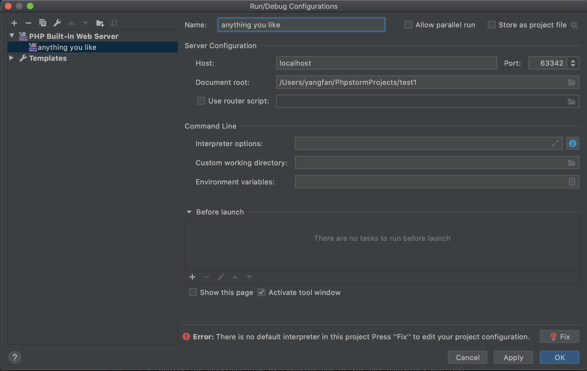
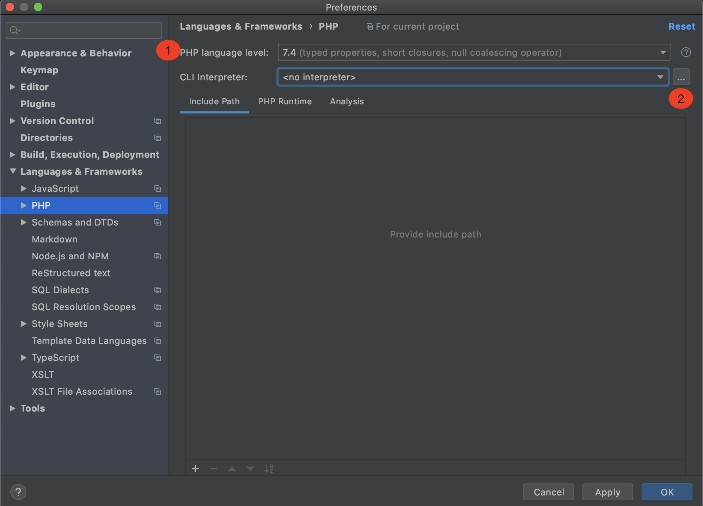
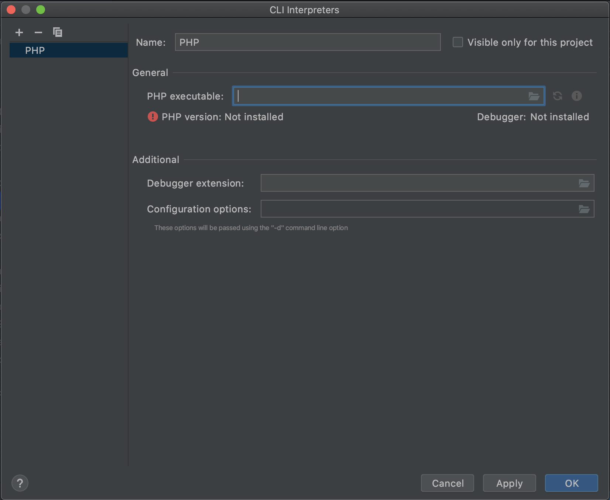

## Lab9 - PHP

### Abstract

Goal of this lab: build PHP environment & write simple PHP code  

> ##### File Structure:  
>
>      /figures  
>      /screenshots  
>      lab9.md  
>      lab9-exercise0.php  
>      lab9-exercise1.php  

__DDL: 23:59:59  May 31th 2020__

__Hint: Please contact us if you have any questions__  

### Setting up PHP  

You should install PHP first before this lab. If you have installed it, you can skip this part and do exercises.  
>#### For windows:  
>>Follow this [video](https://mooc1-1.chaoxing.com/nodedetailcontroller/visitnodedetail?courseId=203371380&knowledgeId=147185698) to install **XAMPP**  

>#### For Mac:  
>>Mac itself has php and apache service. So you can use PHP that comes with the system,   
>or you can install  PHP by _XAMPP_ or terminal.  
>>
>>#### By XAMPP:  
>>Be careful: Download `xx.installer.dmg` not `xx.vm.dmg`!!!  
>>Once you installed, follow the [blog]() to open service.  
>>You can also follow the [video](https://mooc1-1.chaoxing.com/nodedetailcontroller/visitnodedetail?courseId=203371380&knowledgeId=147185698) to configure you `mysql`.  
>
>>#### Install PHP and Apache on Mac by terminal:(not recommended)  
>>You have to install mysql manually if you install php in this way.  
>>You can follow the [link](https://www.hangge.com/blog/cache/detail_2333.html) to do this part.  
>>_（Step 4 & 5 in this blog are optional)_  
>
### Build PhpStorm For Windows & Mac  
1. Open PhpStorm and create a project.  
2. Click `Add Configuration` on the upper right corner.  
3. `+`,`PHP Built-in Web Server`, and edit the settings as following.    
     
   You can see there is an error below, because we have not set the PHP Interpreter.  
4. Go to Setting.    
   `Windows: Settings` and `Mac: Preferences`  
5. `Languages & Frameworks`,`PHP`.  
   Step1: select PHP Language level as your version.  
   Step2: click `···` button to select `CLI Interpreter`  
     
6. `+`,`Other Local`, and edit the settings.  
     
   Choose executable php file. The location of it:  
   >For windows:  
   >`X:\your_path\xampp\php\php.exe`  
   
   >For Mac:  
   >If you use XAMPP:  
   >`/Applications/XAMPP/xamppfiles/bin/php-7.4.6`  
   >If you use terminal:  
   >`/usr/local/bin/php`  
7. Click `Apply` & `OK`  
8. Configure `Deployment`   
     
   select `+`,`Local or mounted folder`  
   Folder: select your project address  
   Web server url: `http://localhost:63342` (63342 is the port you set when you add configurations)  
9. Click `Apply`,`OK`.  
                                                                                                                                                                                                                                                              
                                                                                                                                                                                                                                                                                            

### Exercise0: Test Environment  
Test your environment!  
Here are two choices, and you just select one of them.  

>##### Choice 1:  
> 1. move `lab9-exercise0.php` to php root directory.  
>
>    For Windows: `htdocs` located in `X:\your_path\xampp\htdocs`    
>   
>    For Mac:   
>      If XAMPP: `htdocs` located in `/Applications/XMAPP/htdocs/`    
>      If terminal: root directory is `/usr/local/var/www`  
>2. visit: <http://localhost/lab9-exercise0.php>  

>##### Choice 2:  
>Since you have built the environment of PhpStorm, just configure this project and visit `lab9-exercise0.php` in browser via PhpStorm.  

**Please save the screenshot and put it in directory** `/screenshots`  

### Exercise1: Your first PHP script  
1. Examine `lab9‐exercise1.php` in a text editor and then load it in a browser (that is, using the same technique as in the previous exercise). 
You should see that the PHP echo statement prints out a string and that an echo statement outside of the PHP tags does not get executed.  
2. Clear the initial echo statement. Add an echo statement inside of the PHP tags that outputs the data and time.  

   `echo "This page was generated: " . date("M dS, Y");`  
   
   The dot operator in PHP is used to concatenate values. Your page will now also output a String like: May 20th, 2020  
   
3. Examine the markup received within the browser (e.g., View Source). PHP is processed by the server and is not sent to the browser.  
4. Modify the code you just entered as follows and then test in browser.    

   `echo "This page was generated: " . date("M dS, Y") . "
";`  
   
   Notice that we can programmatically output `HTML` via the echo command.  
5. Modify the previous line by removing one of the dot operators and test.  
   This will generate an error. As long as your error reporting settings are at the default setting, you should see a syntax error message in the browser along with an indication of the line number of the error.  
6. Fix the syntax error and retest.  
7. Modify the code as follows and then test in browser.  

        $d = date("M dS, Y");
        echo "This page was generated: " . $d . "
";
   
   You should notice no change in the browser. This new version differs in using a variable `$d`. **Variables can be named anything but must begin with the `$ symbol`.**  
8. Modify the code as follows and then test in browser.  

        $date = date("M dS, Y");
        echo "This page was generated: " . $date . "
";
   You should again notice no change in the browser. The new variable name `$date` is to remind you that variables begin with the `$ symbol`, while functions have brackets after their name. So, in this example, the variable $date is assigned the value returned by the function `date()`.  
9. Experiment with the string passed into the `date()` function. See if you can make the following formatted string (note the day will be today)  

   `Wednesday, February 26th , 2014 15:43:22`
   
   You will need to make use of documentation from:<http://ca1.php.net/manual/en/function.date.php>  
10. To calculate the number of days remaining in the year, consider the format string `"z"` passed to the `date()` function. For instance, `date("z")` returns the numbers of days elapsed this year, so we can calculate how many days are remaining by subtracting it from 365.  

        $remaining = 365 ‐ date("z");
        echo "There are ". $remaining . " days left in the year";
11. The above calculation does not work if the current year is a leap year.  Please correct the above calculation to account for leap years.  
    
    _Hint: leap years have an extra day in the year. Simply add one to the calculation!_

**Please save the screenshot and put it in directory** `/screenshots`  